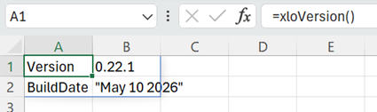
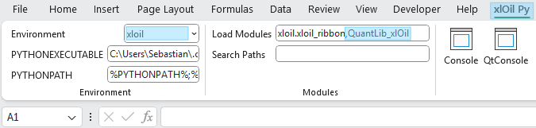
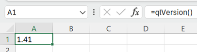
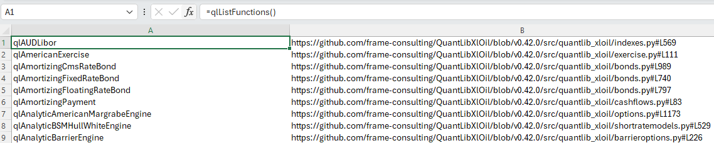
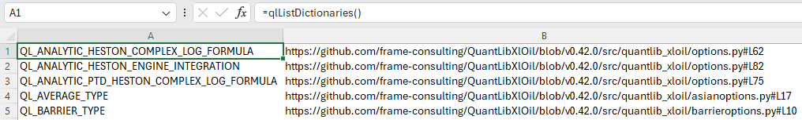
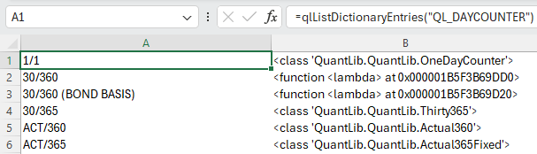
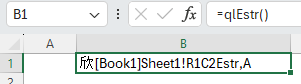

# Getting Started

This sections explains how to install QuantLibXlOil and how to access QuantLib functions in Excel.

QuantLibXlOil can be installed via pip.

**Note:** Remove any installation of the classical QuantLib Excel add-in if installed prior to installing QuantLibXlOil.


## Setup Python Environment

We recommend setting up a clean Python environment with [`conda`](https://docs.conda.io/projects/conda/en/latest/user-guide/tasks/manage-environments.html) (or `venv`).

```
conda create -n xloil python
conda activate xloil
```

## Install QuantLibXlOil and Dependencies

QuantLibXlOil is available via pip.

```
pip install -U quantlib_xloil
```

This step also installs the following dependencies:

- xlOil for interfacing Python and Excel.
- QuantLib library with Python interface.

## Install xlOil Excel Add-in

xlOil comes with an installer script which can be run on the command line within the Python environment.

```
xloil install
```

Above step installs the xlOil Excel add-in and an `xlOil.ini` configuration file. Details on xlOil installation can also be found [here](https://xloil.readthedocs.io/en/stable/xlOil_Python/GettingStarted.html#introduction).

Installation can be verified by opening Excel with a blank workbook. Type `=xloVersion()` in an empty cell and enter. This should display an output similar to the one below.



## Load QuantLibXlOil Functions

To make the QuantLib wrapper functions available in Excel, the xlOil add-in needs to be configured.

xlOil comes with a custom menu ribbon *xlOil Py*. The menu block *Modules* contains a text input field *Load Modules*.

Add `QuantLib_xlOil` to the text field *Load Modules*. Use comma separation without spaces. The resulting entry in *Load Modules* should be

```
xloil.xloil_ribbon,QuantLib_xlOil
```



Restart Excel and open a blank workbook.

Test the QuantLib functions by entering `=qlVersion()` in an empty cell. This should produce a result like `1.41`.



Now, you are all set for QuantLib in Excel.


## QuantLib Functions and Function Arguments

A list of available QuantLib functions and links to their implementation can be queried in Excel via `=qlListFunctions()`.



Many QuantLib function arguments encode QuantLib enumerations or *enumerated* classes. Examples are business day conventions and day counters.

QuantLib enumerations and *enumerated* classes are represented as strings organised via dictionaries in QuantLibXlOil. A list of dictionaries and links to their implementation can be viewed in Excel via `=qlListDictionaries()`.



For each dictionary, the entries can be inspected via `qlListDictionaryEntries(...)`



For above `QL_DAYCOUNTER` example, some string keys are mapped directly to QuantLib classes. Other classes, that need additional parameters to construct objects, are wrapped in lambda expressions which do not give a sensible output here. Please check the source code to see the actual QuantLib implementation.


## QuantLib Objects in Excel

Return values of QuantLib functions can be of basic type (string, integer, float and boolean) or complex type. Results of basic types are represented directly in the Excel cell.

Results which are list-like objects are unpacked and the elements of the list are shown in the Excel cells.

Complex result types are, for example, QuantLib classes. Such results are stored in an xlOil object repository. The return value is a string with a reference to the QuantLib object in the repository.



xlOil uses a particular [methodology](https://xloil.readthedocs.io/en/stable/xlOil_Python/TypeConversion.html#cached-objects) to compose and resolve the object references. In particular, the Mandarin xīn symbol 欣 (*happy, joyful*) is used to identify cache strings.

Such cache strings can be passed as arguments back in QuantLib functions. xlOil resolves the corresponding object and passes it to the function in Python.

An approach for more user-friendly object reference names is documented in the [QuantLibXlOil Extras](./40_quantlib_xloil_extras.md#alias-repository) section.