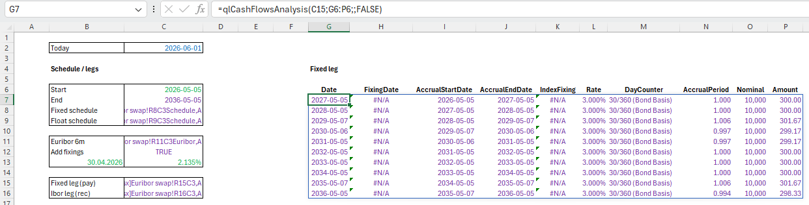
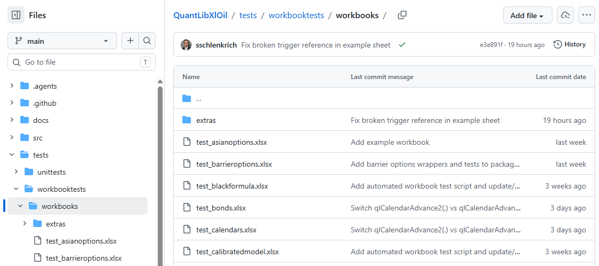

# Example Sheets

This section lists example sheets which are setup as part of the package testing framework.

## Interest Rate Derivatives

An illustrative example of QuantLib in Excel is provided via the [interest rate derivatives sheet](https://github.com/frame-consulting/QuantLibXlOil/blob/main/tests/workbooktests/workbooks/extras/example_interest_rate_derivatives.xlsx). You can download the sheet using the *Download raw file* icon.

## Workbook Test Sheets

A comprehensive list of examples are specified in the [workbook test sheets](https://github.com/frame-consulting/QuantLibXlOil/tree/main/tests/workbooktests/workbooks) folder.

