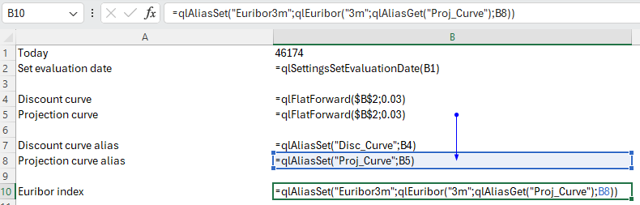
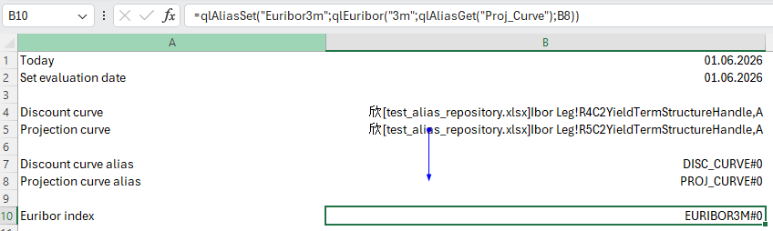

# QuantLibXlOil Extras

In this section, we document features which extend existing QuantLib functions.

We separate these features in the code base from the QuantLib functions to allow for a clear tracking of new and updated QuantLib function in QuantLibXlOil.

## Alias Repository

QuantLibXlOil builds on xlOil's methods to represent complex objects. See [here](./10_getting_started.md#quantlib-objects-in-excel).

Working with xlOil object references can be difficult, for example, if you want to switch between different objects in an ad-hoc Excel analysis.

To allow for more user-friendly organisation of QuantLib objects, we introduce an additional object repository in Python.

QuantLib objects can be stored into the repository via `qlAliasSet([alias], [obj_ref])`. The function returns the specified `alias` concatenated with an object version counter.

Similarly, object references can be retrieved from the repository via `qlAliasGet([alias])`.

The indirection via alias and Python object repository yields more user-friendly identifier like `PROJ_CURVE` and `EURIBOR3M`.

The state of the object repository can be queried via `qlAliasGetRepository(.)`. Details for individual objects can be retrieved via `qlAliasEnvelope([alias])`.

## Cash Flow Analysis

An important tool to analyse valuations are cash flow tables that show details of cash flow calculation steps.

In QuantLib (and QuantLib-Python), cash flows can be queried for various properties depending the cash flow type.

QuantLibXlOil provides the function `qlCashFlowsAnalysis([leg], [columns], ...)`.

The function takes as input a cash flow leg, i.e. a list of cash flows. Moreover, the columns to be calculated are provided as a further list of strings.

The result is a table with the requested calculation details for each cash flow. If the cash flow does not provide the requested detail a `#N/A` value is returned.

The list of columns available can be derived via `qlCashFlowsAnalysisColumns()`.

## Package Inspection

Setting up new QuantLib sheets in Excel can be challenging. Typically, first you need to know which functions are available for the task at hand. Then you need to understand function arguments and implementation.

To make these steps as easy as possible, we introduce the Excel functions `qlListFunctions()`, `qlListDictionaries()` and `qlListDictionaryEntries(...)`.

Details on these functions are shown in the [Getting Started](./10_getting_started.md#quantlib-functions-and-function-arguments) section.

